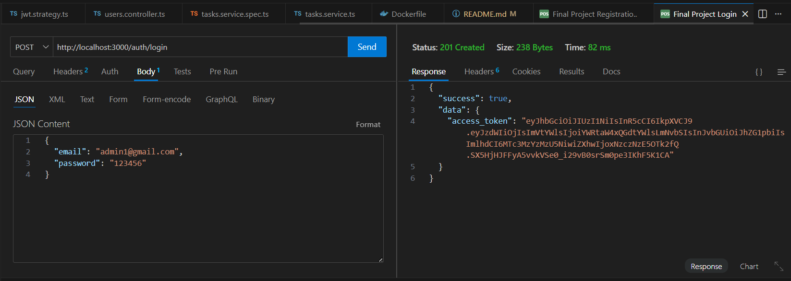
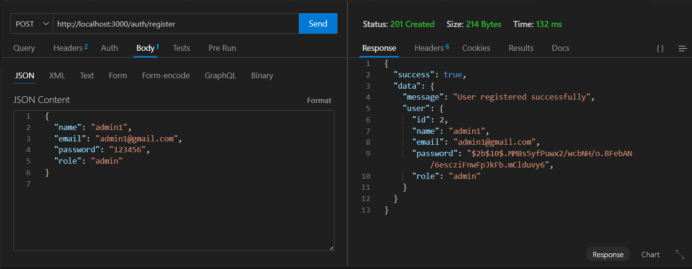
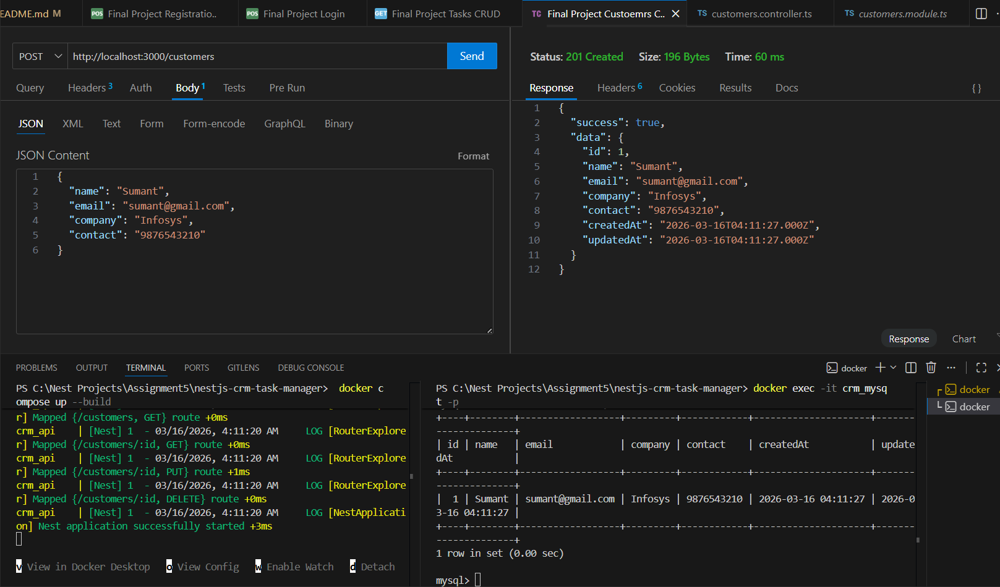
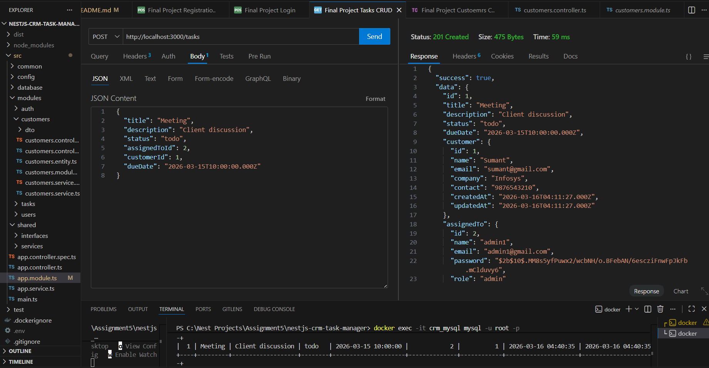
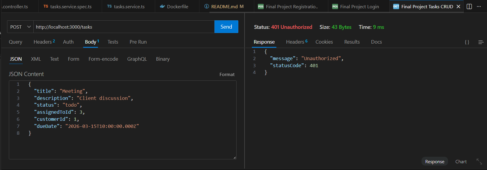
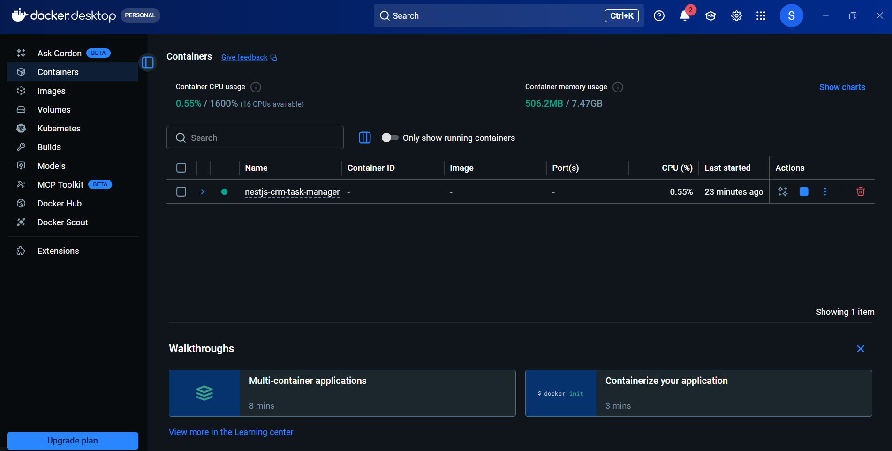
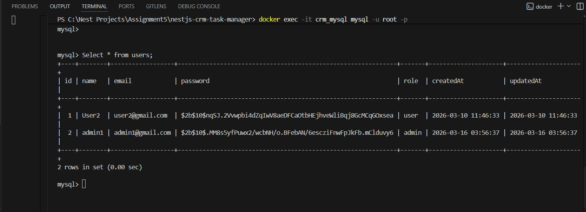
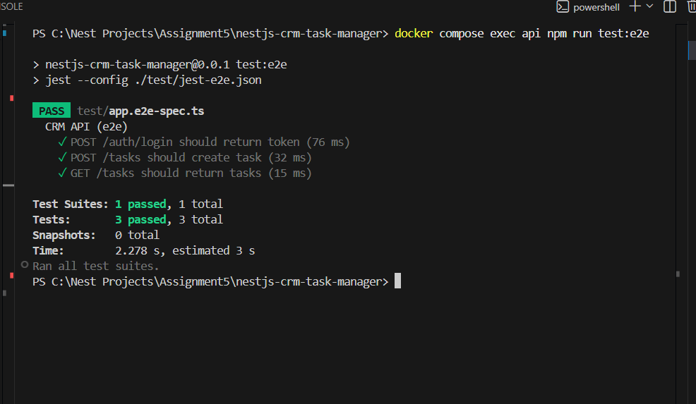
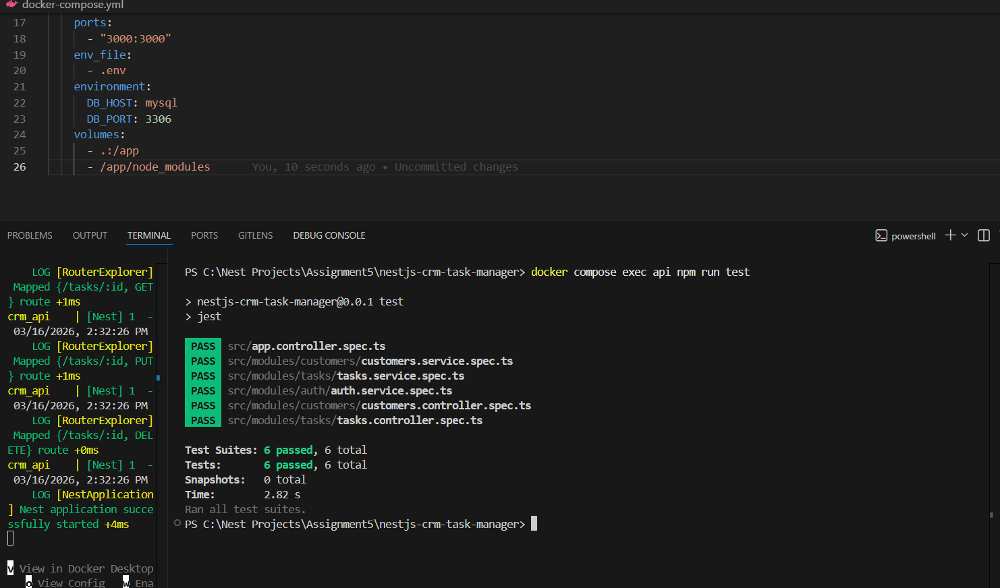

# NestJS CRM Task Manager

A CRM-style Task Manager backend built with **NestJS**, **TypeORM**, **MySQL**, **JWT Authentication**, **RBAC**, **Testing**, and **Docker**.

---

## Features

- User Registration and Login
- Password Hashing with bcrypt
- JWT Authentication
- Role-Based Access Control (Admin / User)
- User CRUD
- Task CRUD
- Customer CRUD
- Task filtering by:
  - status
  - title
  - customer
- Unit Testing with Jest
- E2E Testing with Supertest
- Dockerized setup with MySQL

---

## Tech Stack

- NestJS
- TypeORM
- MySQL
- JWT
- Jest
- Supertest
- Docker

---

## Project Structure

src/
├── common/
├── config/
├── database/
├── modules/
│   ├── auth/
│   ├── customers/
│   ├── tasks/
│   └── users/
test/
Dockerfile
docker-compose.yml
README.md

# Docker SETUP

---

## ⚙️ Commands Section (better structured)

## ⚙️ Setup & Commands

### 🐳 Docker
docker exec -it crm_api npm run migration:run
docker compose build --no-cache
docker compose up --build

## 🌐 API Endpoints 

### 🔐 Auth
- POST /auth/register
- POST /auth/login

### 👤 Users
- GET /users
- GET /users/:id
- PUT /users/:id
- DELETE /users/:id

### 📋 Tasks
- POST /tasks
- GET /tasks
- GET /tasks/:id
- PUT /tasks/:id
- DELETE /tasks/:id

#### Filters
- GET /tasks?status=done
- GET /tasks?title=meeting
- GET /tasks?customerId=1

### 👥 Customers
- POST /customers
- GET /customers
- GET /customers/:id
- PUT /customers/:id
- DELETE /customers/:id

## 📸 Project Demonstration (Docker + API Flow)

### 🔐 Login Flow

## 📸 Project Demonstration (Docker + API Flow)

### 🔐 Login Flow

### 📝 User Registration

### 👥 Customer Creation

### ✅ Create Task (Authorized)

### ❌ Create Task (Unauthorized)

---

## 🐳 Docker Setup & Execution

### 📦 Docker Desktop Running

### 🗄️ Users Table (Docker DB)

### 🧪 E2E Test Execution (Docker)

### ▶️ Test Run Output
